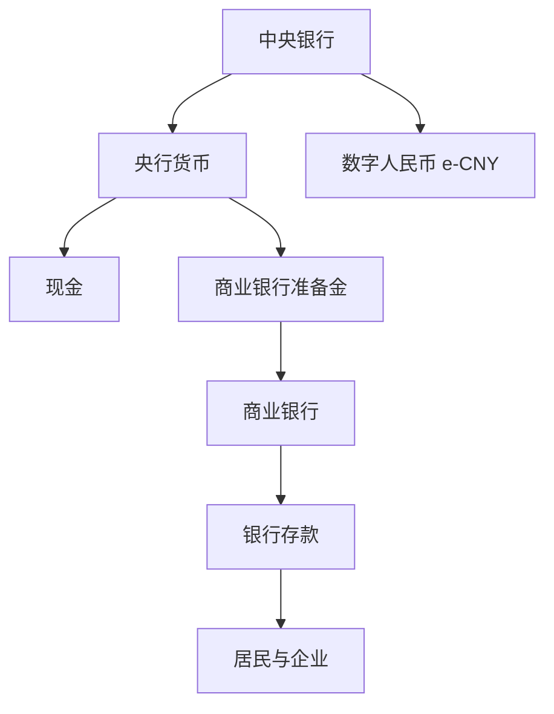

# 数字人民币从零学习

这是一个持续维护的数字人民币（e-CNY）学习仓库。目标不是只会使用数字人民币钱包，而是从货币、银行与央行体系出发，逐步理解数字人民币的政策逻辑、金融架构、支付清算、技术实现、可编程能力、产业应用与跨境方向。

> 学习方法：先建立金融直觉，再进入数字人民币；每一课都尽量使用资产负债表、案例推演、流程图和思考题，而不是只背概念。

## 学习路线

### Week 1｜货币、银行与央行

- [x] [Day 1：钱到底是什么？](week-01-money-and-banking/day-01-what-is-money.md)
- [x] [Day 2：商业银行如何创造货币？](week-01-money-and-banking/day-02-bank-money-creation.md)
- [x] [Day 3：M0、M1、M2 与基础货币](week-01-money-and-banking/day-03-m0-m1-m2.md)
- [ ] Day 4：中央银行到底是干什么的？
- [ ] Day 5：货币政策如何传导？
- [ ] Day 6：通胀、通缩与货币价值
- [ ] Day 7：第一周复盘与综合案例

### Week 2｜数字人民币基础

数字人民币是什么、为什么要做、与现金/银行存款/微信支付宝/稳定币/比特币有什么根本区别。

### Week 3｜数字人民币系统架构

双层运营、钱包体系、账户松耦合、软钱包/硬钱包、身份与权限、运营机构、央行侧核心系统。

### Week 4｜支付与清算

支付、清算、结算的区别；央行货币与商业银行货币如何协同；双离线支付等。

### Week 5｜可编程货币与智能合约

条件支付、财政补贴、供应链、企业资金管控，以及“可编程支付”和“可编程货币”的边界。

### Week 6｜产业案例

政务、零售、交通、供应链金融、工资、财政资金、企业支付等真实场景。

### Week 7｜跨境数字货币

跨境支付、CBDC、多边央行数字货币桥、人民币国际化，以及与 SWIFT/代理行模式的关系。

### Week 8｜未来方向

AI Agent 支付、机器经济、RWA、物联网支付、隐私保护与数字货币基础设施。

## 学习时要始终区分的 5 个概念

1. **财富 ≠ 货币**：房产和股票是财富，但不是 M2 中可直接支付的货币。
2. **央行货币 ≠ 商业银行货币**：现金/准备金与银行存款的发行主体和负债主体不同。
3. **支付工具 ≠ 货币本身**：微信支付、支付宝主要解决支付体验；数字人民币首先是货币形态问题。
4. **基础货币 ≠ M2**：央行投放基础货币不等于居民存款同比例增加。
5. **数字人民币 ≠ 区块链币**：它是主权法定货币的数字形态，不是去中心化加密资产。

## 当前进度

已完成 Week 1 的 Day 1～Day 3。下一课：**Day 4｜中央银行到底是干什么的？**
