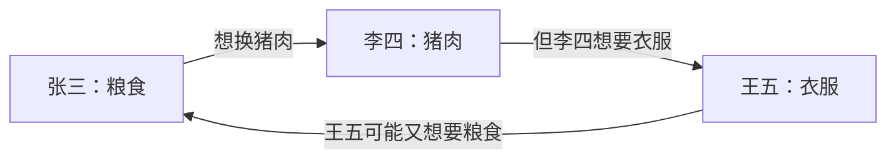
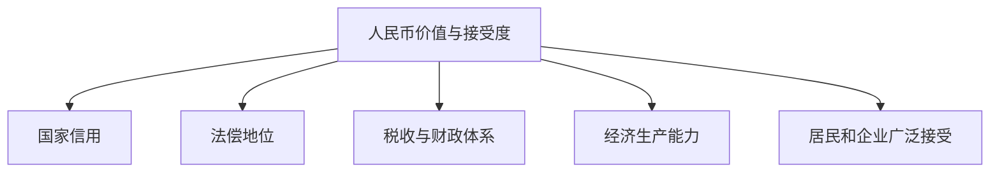

# Day 1｜钱到底是什么？

## 学习目标

学完这一课，要能回答：

- 为什么一张纸能值 100 元？
- 为什么货币能降低交易成本？
- 现代人民币为什么不需要与黄金一一对应？
- 为什么“银行存款”和“现金”虽然都叫钱，却不是同一种负债？
- 数字人民币为什么首先是“货币形态”的变化，而不只是支付 App？

---

## 1. 从没有钱的世界开始

假设一个小村庄里只有三个人：

- 张三种粮食
- 李四养猪
- 王五做衣服

没有货币时，交易依赖以物易物。



问题是：张三想要李四的猪肉，不代表李四恰好想要张三的粮食。

这叫做**需求的双重巧合**：交易双方必须同时需要对方拥有的东西。

货币出现后，交易链条被拆开：


张三不必先找到“正好想要粮食的养猪人”，只需要把粮食卖成大家都接受的钱。

---

## 2. 货币的三个核心功能

### 2.1 交易媒介

你写代码，不需要直接拿“代码劳动”去换大米。


货币把复杂的物物交换拆成两次交易。

### 2.2 价值尺度

货币让不同商品可以统一计价：

| 商品 | 价格 |
|---|---:|
| 咖啡 | 30 元 |
| 手机 | 6,000 元 |
| 汽车 | 200,000 元 |

否则你需要维护大量交换比率，例如“1 部手机 = 200 杯咖啡”。

### 2.3 价值储藏

今天劳动创造的价值，可以先保存为货币，在未来消费。

但价值储藏不是绝对的。如果物价持续上涨，同样 100 元未来能买到的东西会更少。

因此要区分：

- **名义金额**：账户还是 100 元
- **实际购买力**：100 元能买多少商品

这会在 Day 6 的通胀部分重点讨论。

---

## 3. 为什么人民币有价值？

现代人民币属于**法定信用货币**。它的价值不是因为每 100 元人民币背后都锁着等值黄金。

更准确的理解是，人民币的接受基础来自多层制度与社会共识：



因此，“大家愿意收人民币”并不是单纯心理现象，它背后还有法律、财政、金融和经济体系支撑。

---

## 4. 现金和银行存款看起来一样，金融性质却不同

假设你有两种 100 元：

### 情况 A：手里的一张 100 元纸币

它是中央银行发行的货币。

### 情况 B：银行卡 App 显示余额 100 元

从你的角度，这是你的资产；从商业银行角度，这是银行欠你的钱，也就是银行的负债。

可以画成：


这也是理解现代货币体系的第一个分层：

| 你持有的“钱” | 主要负债主体 |
|---|---|
| 现金 | 中央银行 |
| 银行存款 | 商业银行 |

二者日常都能支付，所以使用体验很接近；但从金融资产负债关系看，并不是同一种东西。

---

## 5. 为什么这和数字人民币有关？

数字人民币的关键不是“扫码更快”，而是：

> **让法定人民币以数字形式存在和流通。**

先建立一个简化对比：

| 形态 | 核心性质 |
|---|---|
| 纸钞现金 | 央行货币 |
| 银行卡余额 | 商业银行存款 |
| 微信/支付宝支付 | 主要是支付工具和支付账户体系 |
| 数字人民币 | 数字形态的法定货币 |

因此不能把数字人民币简单理解为“央行版支付宝”。

支付宝和微信首先解决“怎么付”；数字人民币首先涉及“付出去的这个钱本身是什么”。

---

## 6. 一个最重要的会计视角

如果你的银行卡里有 10 万元：

### 对你来说

```text
资产：银行存款 100,000 元
```

### 对银行来说

```text
负债：客户存款 100,000 元
```

同一笔钱同时出现在不同主体的资产负债表两侧。

这个视角极其重要，因为 Day 2 会看到：当银行发放贷款时，银行可以同时增加一项贷款资产和一项客户存款负债。

---

## 7. 常见误区

### 误区 1：人民币值钱是因为背后有等额黄金

现代信用货币并不按这种方式运行。

### 误区 2：银行账户里的钱就是银行替我保管的一叠现金

银行存款是银行对客户的负债，并不是给每个储户单独锁一箱现金。

### 误区 3：支付宝余额、银行卡余额、现金、数字人民币完全一样

从“能否买东西”的体验看很像，但从发行主体、负债主体和支付基础设施看，需要区分。

---

## 8. 本课结论

记住四句话：

1. **货币首先解决交易中的信任、计价和交换效率问题。**
2. **现代人民币是法定信用货币，不需要与黄金一一对应。**
3. **银行存款是你的资产，同时是商业银行对你的负债。**
4. **数字人民币不是简单的新支付 App，而是人民币本身的数字化形态。**

---

## 9. 思考题

如果整个社会只有 100 亿元现金，社会中的“钱”是否最多只有 100 亿元？

答案是否定的。原因会在 Day 2 展开：**商业银行可以通过信贷活动创造存款货币。**
