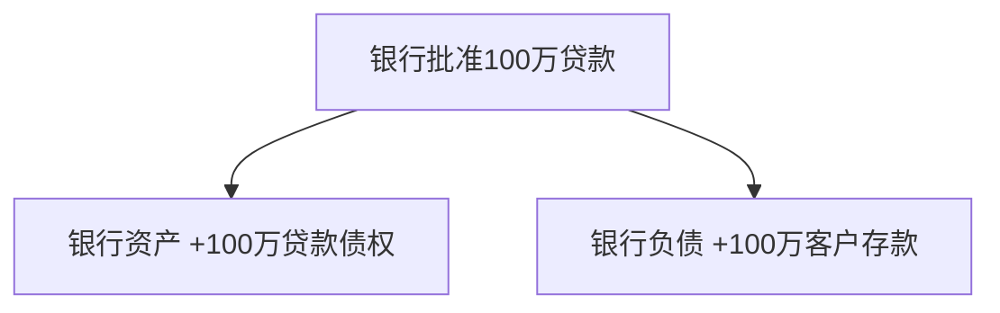
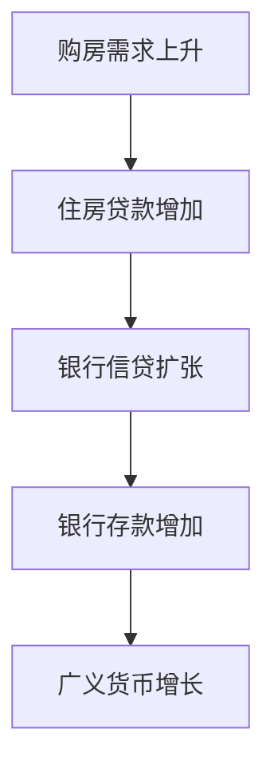
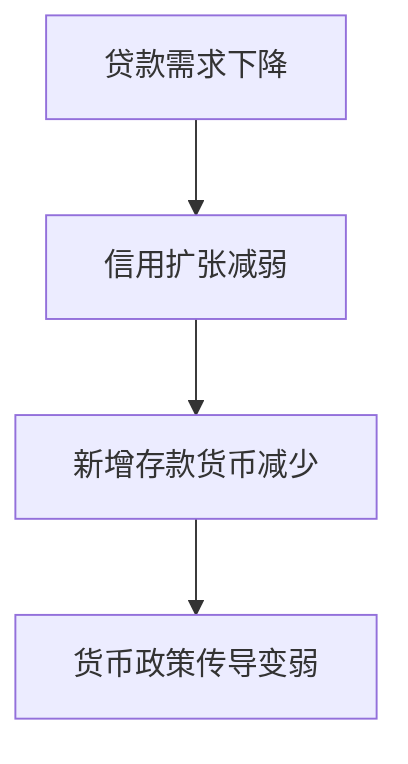
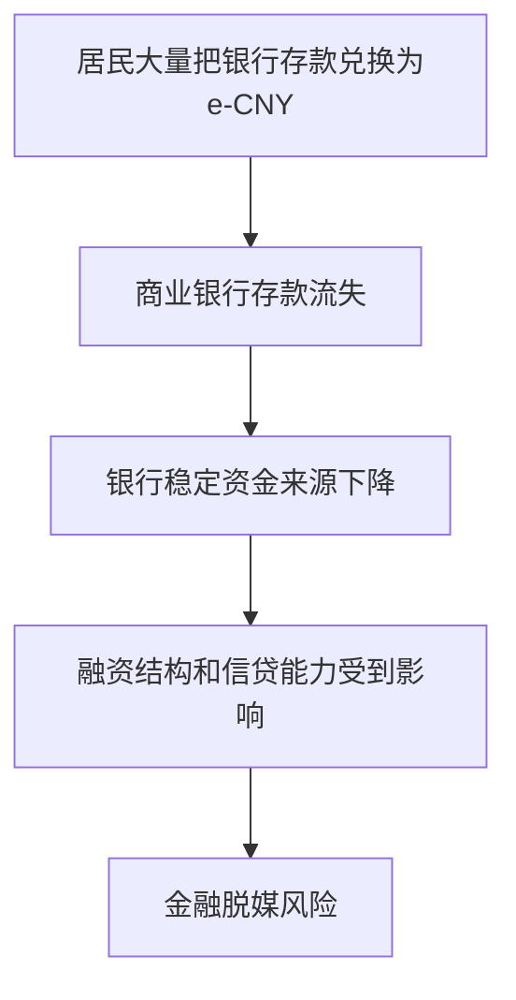

# Day 2｜商业银行如何创造货币？

## 学习目标

学完这一课，要能回答：

- 银行发放贷款时，为什么会同时创造存款？
- 银行为什么不是简单把 A 的存款搬给 B？
- 银行新增存款负债以后为什么不能不管？
- 为什么银行不能无限放贷？
- 流动性风险、信用风险、资本约束分别是什么？
- 为什么跨行支付会牵涉央行准备金？

---

## 1. 从一笔 100 万贷款开始

假设你的公司要买服务器，需要向银行贷款 100 万元。

贷款前：

```text
你的银行账户余额：0 元
```

银行审批贷款后：

```text
你的银行账户余额：1,000,000 元
```

这 100 万并不是简单理解为银行从另一个客户账户里拿走 100 万再塞给你。现代商业银行放贷时，会同时扩张资产和负债。

### 银行记账

| 银行资产 | 银行负债 |
|---|---|
| 对你的贷款 +100 万 | 你的存款 +100 万 |

也就是说：



所以一个关键结论是：

> **银行发放贷款时，可以同时创造新的银行存款。**

这就是“贷款创造存款”的基本含义。

---

## 2. 这是不是凭空变出 100 万？

从社会银行存款余额看，贷款发放后确实新增了 100 万可支付存款。

但银行并没有免费获得 100 万财富，因为它同时承担了 100 万负债，并持有一项 100 万贷款资产。

```text
银行新增：

资产：你欠银行 100 万
负债：银行欠你 100 万
```

因此更准确的说法是：

> **商业银行通过信用扩张创造存款货币，同时承担相应的资产风险与负债责任。**

---

## 3. 为什么银行新增的负债必须管？

这里是本课最容易被忽略、但最关键的地方。

假设你的贷款期限是 10 年：

```text
银行资产：10 年后逐步收回的贷款 100 万
银行负债：客户随时可以转走的存款 100 万
```

两边金额一样，但兑现时间完全不同。

这就产生了银行最典型的结构性问题之一：

> **短期负债 + 长期资产 = 期限错配。**

如果客户今天就要把钱转走，银行不能说“等借款人十年以后还我钱再给你”。

---

## 4. 跨行支付为什么会牵涉央行准备金？

假设：

- 你在银行 A
- 服务器公司在银行 B
- 你向银行 A 贷款 100 万后，马上把这 100 万付给服务器公司

客户层面看到的是：

```text
你的银行A存款        -100万
服务器公司的银行B存款 +100万
```

但银行之间还要完成结算。

简化流程：


银行 A 不能拿“你欠它的 10 年期贷款合同”直接当作银行间最终结算资产。

银行之间需要高流动性的结算资产，核心之一就是**商业银行在央行的准备金**。

所以要区分：

```text
客户之间支付：主要表现为银行存款变化
银行之间结算：需要央行货币层面的结算资产
```

---

## 5. 一个完整的银行资产负债表示例

假设一家银行初始状态如下：

### 发放贷款前

| 资产 | 金额 | 负债和资本 | 金额 |
|---|---:|---|---:|
| 准备金 | 200 万 | 客户存款 | 900 万 |
| 各类贷款 | 800 万 | 资本 | 100 万 |
| **合计** | **1,000 万** | **合计** | **1,000 万** |

银行新发放 100 万贷款，并把对应存款记入借款人账户后：

### 发放贷款后

| 资产 | 金额 | 负债和资本 | 金额 |
|---|---:|---|---:|
| 准备金 | 200 万 | 客户存款 | 1,000 万 |
| 各类贷款 | 900 万 | 资本 | 100 万 |
| **合计** | **1,100 万** | **合计** | **1,100 万** |

这里银行资产负债表整体扩张了 100 万。

但是，如果借款人把 100 万全部转到另一家银行，原银行就面临流动性流出，需要通过准备金、同业融资、资产变现、央行工具等方式管理流动性。

---

## 6. 银行为什么不能无限创造货币？

理论上，银行放贷可以创造存款；现实中却受很多约束。

### 6.1 信用风险

银行的资产端不是现金，而是“别人未来还钱的承诺”。

如果借款人违约：


银行已经创造出的那 100 万存款，可能早就支付给了第三方，不能因为原借款人违约，就把第三方账户里的钱直接删除。

因此坏账会真正侵蚀银行资本。

### 6.2 流动性风险

银行可能“有资产但没有足够现钱”。

例如：

```text
资产：
房贷          800 亿
企业贷款      150 亿
现金/准备金     50 亿

负债：
居民和企业存款  900 亿
其他负债        50 亿
资本            50 亿
```

如果一天有 300 亿存款要求转出，银行账面总资产虽然大于负债，但大量资产是 10 年、20 年、30 年期贷款，不能瞬间变成 300 亿结算资金。

所以：

> **偿付能力和短期流动性不是一回事。**

### 6.3 资本约束

银行必须有自己的资本吸收损失。

假设：

```text
资产 1000 万
负债  900 万
资本  100 万
```

如果发生 50 万坏账：

```text
资产变成 950 万
负债仍是 900 万
资本只剩 50 万
```

如果继续坏下去，最终可能出现：

```text
资产 < 负债
```

这意味着银行可能资不抵债。

### 6.4 监管与准备金体系

银行还受到资本充足率、流动性、准备金、风险集中度、监管政策等多重约束。

### 6.5 真实贷款需求

即使银行愿意贷，也需要：

- 有人愿意借钱
- 项目有还款能力
- 风险收益合适

所以银行不会因为“理论上能创造存款”就无限扩张信贷。

---

## 7. 银行真正赚的是什么？

银行不是靠“按键盘创造 100 万”直接赚 100 万。

一个极度简化的模型：

```text
贷款利率       4%
存款和融资成本 2%
----------------
初始利差       2%
```

但这 2% 还要覆盖：

- 坏账损失
- 员工和网点
- IT 系统
- 合规成本
- 资本成本
- 税费
- 流动性管理成本

所以商业银行的本质更像是在经营：

> **信用风险 + 期限转换 + 流动性 + 支付结算 + 资金价格。**

---

## 8. 贷款偿还时，货币会发生什么？

假设最初贷款 100 万，暂时忽略利息。

贷款发放：

```text
银行贷款资产 +100万
客户存款负债 +100万
```

客户后来偿还本金：

```text
客户存款 -100万
银行贷款资产 -100万
```

因此，相应的存款货币被消灭。

可以概括为：


现代货币体系因此不是一个固定的钱池，而是在不断创造、流通、偿还和消灭。

---

## 9. 为什么房地产和信贷周期关系很深？

如果大量居民贷款买房：



反过来，如果居民和企业不愿意借钱，甚至提前还贷：



所以“央行提供了很多流动性”并不意味着社会一定马上出现同比例的信用扩张。

---

## 10. 与数字人民币的连接

现在可以第一次理解一个很重要的问题。

### 银行存款

```text
本质：商业银行对你的负债
```

### 数字人民币

```text
本质：数字形态的央行货币
```

于是从信用层级上看，它们不是完全同一种资产。

这马上带来一个金融体系设计问题：

> 如果所有居民都认为央行货币比商业银行存款更安全，并把大量存款换成数字人民币，商业银行的存款负债和融资结构会发生什么？

可能形成：



这也是后面理解数字人民币为什么采取双层运营、为什么设计上需要避免对商业银行体系造成剧烈冲击的重要入口。

---

## 11. 本课结论

记住六句话：

1. **商业银行发放贷款时，可以同时创造新的银行存款。**
2. **新增存款是银行的负债，不是银行免费得到的钱。**
3. **贷款资产往往长期，存款负债却可能随时流出，因此银行必须管理期限错配和流动性。**
4. **借款人违约会让银行资产受损，最终侵蚀银行资本。**
5. **银行间支付结算需要央行货币层面的结算资产。**
6. **银行不能无限放贷，因为受资本、流动性、风险、监管和贷款需求共同约束。**

---

## 12. 思考题

央行向银行体系提供 1 万亿元流动性，社会中的 M2 是否一定增加 1 万亿元？

答案：**不一定。**

因为央行流动性只是给信用扩张创造条件，真正形成大量新增银行存款，还要经过银行放贷、企业居民借贷需求、风险判断和经济活动等环节。

下一课将正式解释：**基础货币、M0、M1、M2 到底是什么。**
