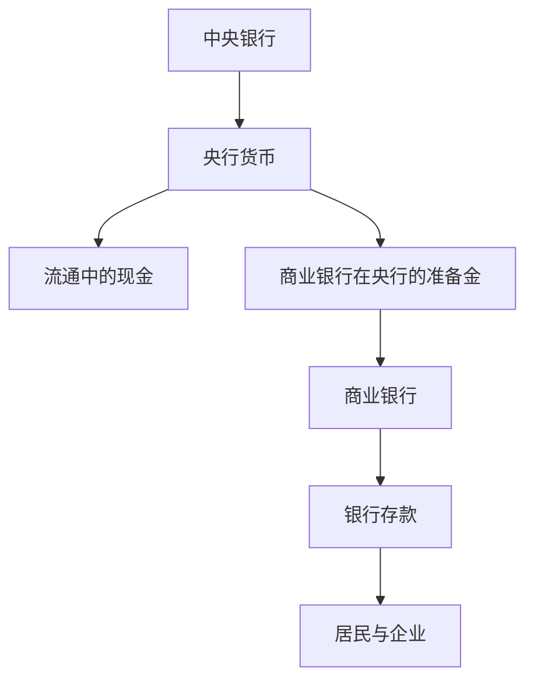
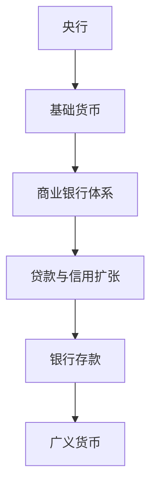
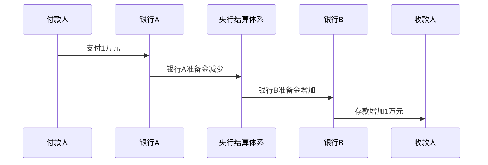
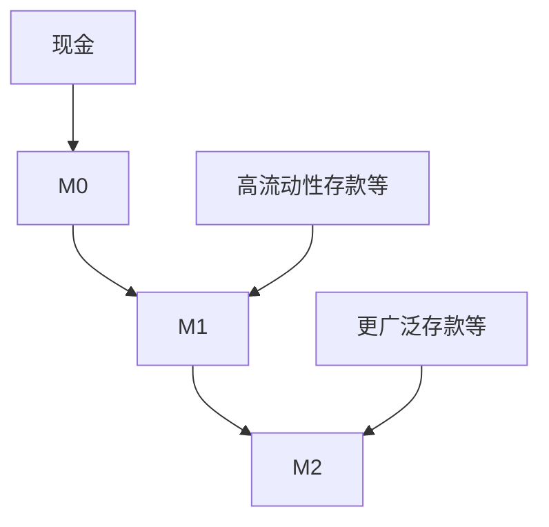
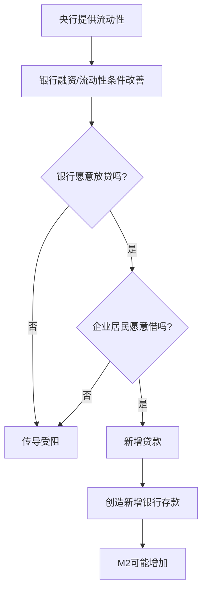
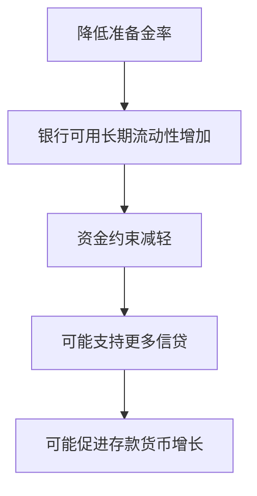
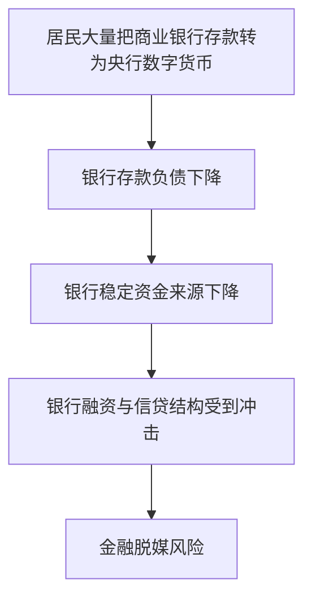
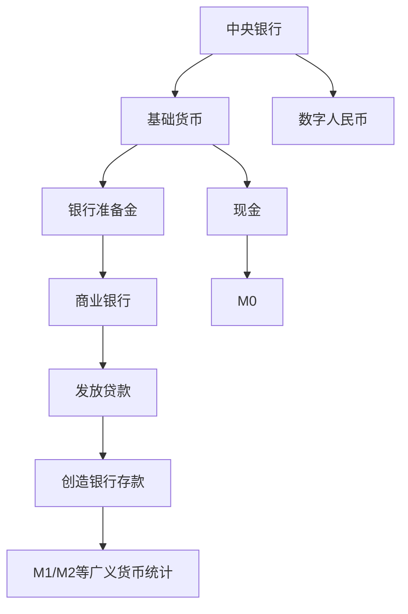

# Day 3｜M0、M1、M2 与基础货币

## 学习目标

学完这一课，要能回答：

- 基础货币是什么？为什么不等于 M2？
- M0、M1、M2 为什么要分层统计？
- 银行准备金是什么？
- 为什么央行投放 1 万亿元流动性，不等于居民账户增加 1 万亿元？
- 降准、降息分别影响什么？
- 为什么数字人民币经常与 M0 联系在一起？

---

## 1. 先把“钱”分成两层

现代货币体系最重要的直觉之一，是：

> **央行货币和商业银行货币不是一回事。**

可以先用一张简化图理解：



公众平时大量使用的是商业银行存款；银行体系内部最终结算的重要基础，则是央行货币。

---

## 2. 什么是基础货币？

入门阶段可以把基础货币理解成：

```text
基础货币 ≈ 流通中的现金 + 银行体系持有的央行准备金等
```

例如：

```text
流通现金      100 亿
银行准备金    900 亿
-------------------
基础货币     1000 亿
```

为什么叫“基础”货币？

因为商业银行的信贷和支付体系，是在这个央行货币层之上运行的。



所以第一个必须记住的结论是：

> **基础货币 ≠ M2。**

---

## 3. 银行准备金到底是什么？

假设你在银行 A 有 10 万元存款，现在向银行 B 的用户转账 1 万元。

客户看到：

```text
你的银行A存款      -1万
对方银行B存款      +1万
```

银行层面还要完成结算。极度简化后可以表示为：



因此可以建立这个直觉：

```text
居民和企业之间：主要使用银行存款
银行之间最终结算：依赖央行货币层面的结算资产
```

---

## 4. 为什么还要统计 M0、M1、M2？

因为“钱”的流动性不同。

100 元现金可以立刻支付；一笔定期存款虽然也属于很强的货币性资产，但支付便利程度不同。

所以货币统计会按照不同范围观察经济中的货币。

> 注意：中国货币统计口径会随政策和金融发展调整，因此学习时应先理解经济含义，再查看当期官方口径，不要只死背某个旧版本定义。

---

## 5. M0：最接近传统现金的钱

入门可以理解为：

> **M0 主要反映流通中的现金。**

它的特点是流动性极高，拿出来就能直接支付。

例如：

- 100 元纸币
- 50 元纸币
- 硬币

这也是为什么数字人民币早期政策表述经常强调其与 **M0 数字化** 的关系：它首先承担的是法定货币现金数字化的角色，而不是简单替代所有银行存款。

---

## 6. M1：更偏“活的钱”

M1 的核心经济含义，可以先理解为：

> **经济主体手中具有较强即时支付能力、交易活跃度较高的货币。**

例如一家企业账户里有 1000 万元，并且准备拿来：

- 发工资
- 采购
- 支付供应商
- 投资

这种钱的交易属性很强。

所以观察 M1，常常是在观察经济活动中“准备随时动起来的钱”有多少。

---

## 7. M2：广义货币

M2 的范围更广。

可以先建立这样一个直觉：

```text
M0：最接近现金
M1：高流动性的货币
M2：M1 + 更广泛的存款等货币性资产
```



越往 M2 扩展，统计范围越大，但平均流动性相对更弱。

---

## 8. 财富不等于货币

假设你拥有：

```text
房产   1000 万
股票    500 万
存款    100 万
```

你可能拥有 1600 万元财富，但不能说你拥有 1600 万元 M2。

为什么？

因为股票和房产不是日常支付媒介。

要消费，通常要先：


所以必须区分：

> **资产价值、财富和货币供应量，是不同概念。**

---

## 9. 为什么央行投放 1 万亿元，不等于 M2 增加 1 万亿元？

这是本课最重要的问题。

央行向银行体系提供流动性，首先影响的是银行体系的央行货币、融资环境和流动性条件。

但要形成新的广义货币，通常还要经过信用扩张。



中间任何环节都可能断掉。

例如：

- 企业担心未来需求，不愿投资
- 居民不愿贷款买房或消费
- 银行认为借款人风险过高，不愿放贷

所以：

> **央行创造宽松条件，不等于实体经济一定愿意加杠杆。**

---

## 10. “央行放水”为什么是个容易误导的说法？

媒体常把很多不同政策都叫“放水”，但它们作用层级不同。

例如：

```text
增加银行体系流动性
≠
直接给居民发钱
≠
M2同比例增长
≠
所有资产价格一定上涨
```

真正需要追踪的是政策传导链条。


---

## 11. 什么是降准？

“准”通常指存款准备金制度中的准备金要求。

为了建立直觉，假设某银行相关存款规模 1000 亿元，原本需要按规则保留 100 亿元准备金，政策调整后只需 80 亿元。

那么银行体系可支配流动性空间增加。



关键字是：**可能**。

降准不是：

```text
央行降准1000亿
→ 老百姓银行卡自动 +1000亿
```

---

## 12. 什么是降息？

利率可以理解成“钱的价格”。

假设企业有一个项目：

```text
项目预期回报率 4%
```

贷款利率为 6% 时：

```text
借钱成本 > 项目回报
→ 企业可能不投资
```

贷款利率降到 3% 时：

```text
项目回报 4%
贷款成本 3%
→ 投资意愿可能提高
```

因此，简化理解：

| 工具 | 主要影响 |
|---|---|
| 降准 | 银行体系流动性和约束 |
| 降息 | 资金价格和借贷意愿 |

现实政策工具远比这复杂，但这个框架足够作为入门。

---

## 13. “推绳子”为什么难？

货币政策收紧时，提高融资成本往往能抑制一部分借贷需求。

但经济低迷时，即使降息、降准、增加流动性，也不能强迫企业和居民借钱。

所以会出现：

```text
央行：资金条件已经很宽松
银行：我可以贷
企业：但我不想借
居民：我也不想加杠杆
```

这就是货币政策传导中很重要的现象。

---

## 14. 与数字人民币的连接

数字人民币早期设计强调 M0 定位，一个重要原因是：如果央行直接提供一个无限制、功能上全面替代商业银行存款的“超级央行账户”，可能导致大量存款从商业银行流向央行货币。



因此数字人民币的架构设计必须同时考虑：

- 用户支付体验
- 央行货币属性
- 商业银行体系稳定
- 货币政策传导
- 金融脱媒风险

这也为后面学习**双层运营体系**埋下伏笔。

---

## 15. 三天知识总图



核心关系：

> **央行决定货币体系的基础层和政策环境；商业银行通过信用活动形成大量存款货币；M0/M1/M2用不同范围观察经济中的货币；数字人民币则让我们重新审视公众持有央行货币的数字形式。**

---

## 16. 本课结论

记住六句话：

1. **基础货币和 M2 不是一回事。**
2. **现金与银行准备金属于央行货币的重要组成部分。**
3. **大量日常货币是商业银行存款。**
4. **M0、M1、M2主要用于从不同流动性和统计范围观察货币。**
5. **央行提供流动性不意味着居民和企业账户自动增加相同金额。**
6. **数字人民币与 M0 定位的关系，背后不仅是技术问题，更是金融体系稳定问题。**

---

## 17. 思考题

比较两个场景：

### 场景 A

央行向银行体系提供 1 万亿元流动性，但企业和居民几乎不愿意新增贷款。

### 场景 B

央行没有额外做同规模流动性投放，但银行向信用良好的企业新增发放 1 万亿元贷款。

哪个场景更可能直接推动银行存款和 M2 明显增加？为什么？

提示：回到 Day 2 的核心——**贷款创造存款。**

下一课：**Day 4｜中央银行到底是干什么的？**
