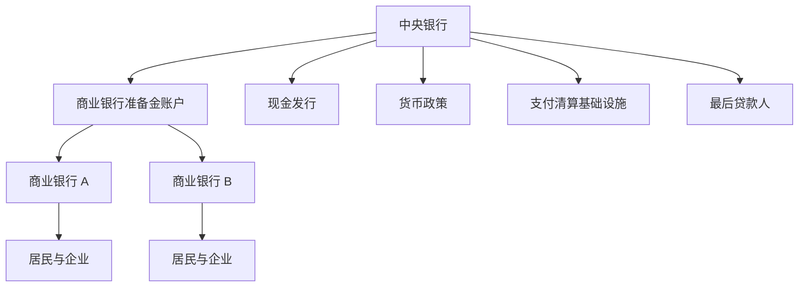
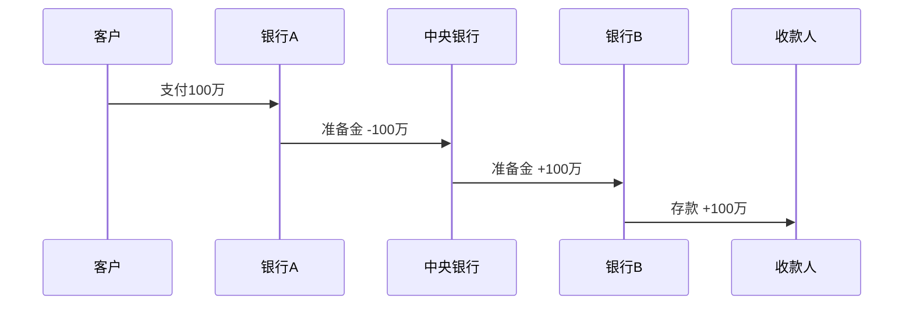
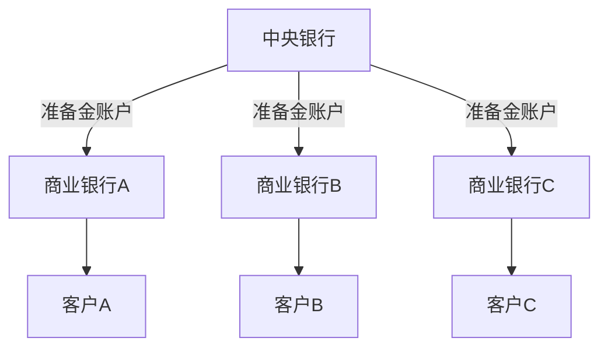
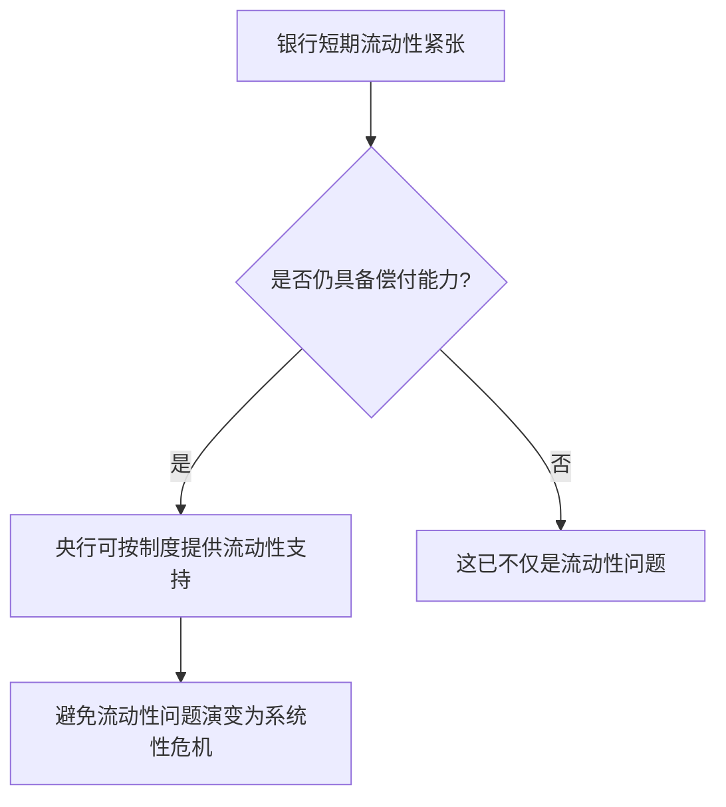
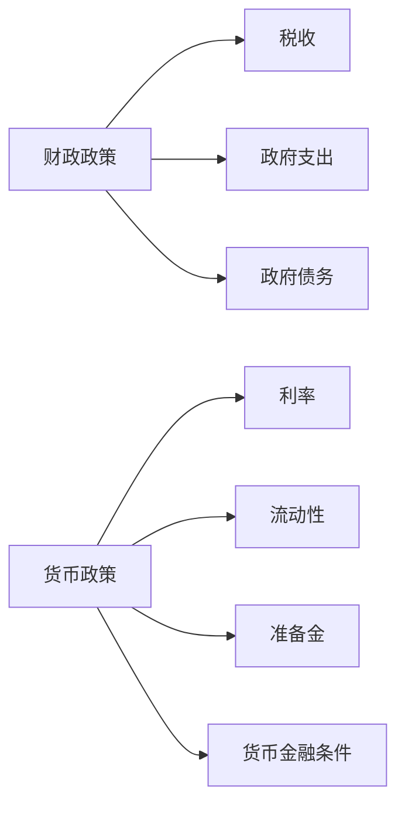
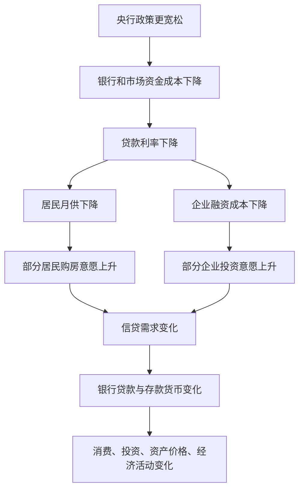
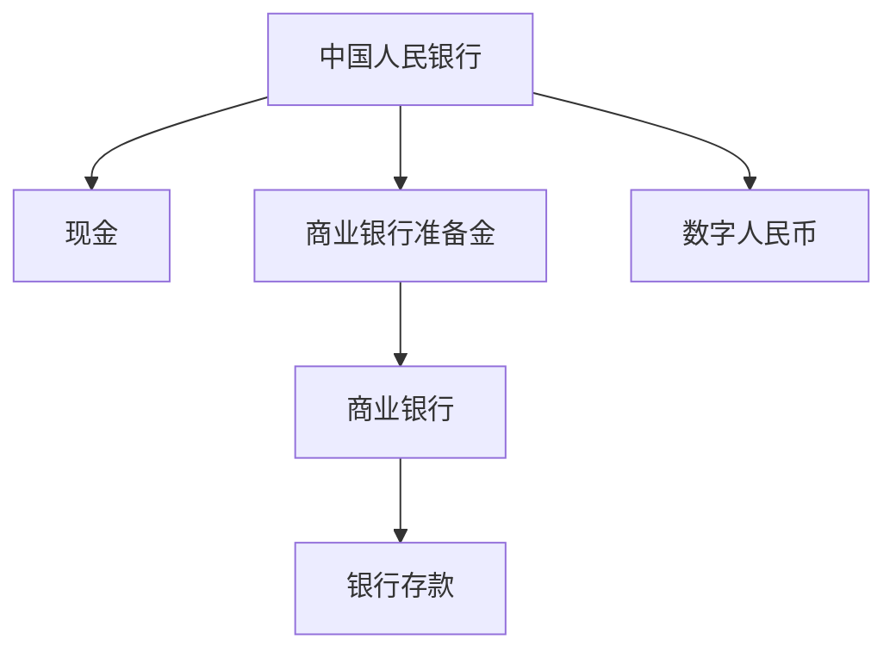

# Day 4｜中央银行到底是干什么的？

> 本课目标：把“央行到底做什么”从新闻口号，变成一套可推演的金融系统模型。

---

## 一、先回答最核心的问题：央行和商业银行到底哪里不同？

我们平时最容易把“中国人民银行”和“工商银行、招商银行、建设银行”都叫做“银行”，但它们在金融体系里的角色完全不同。

商业银行的主要业务，是面对居民和企业：

- 吸收存款
- 发放贷款
- 提供支付结算服务
- 管理信用风险和流动性风险

而中央银行主要面对的是整个金融体系。它更像“金融系统的底层基础设施提供者 + 规则制定者 + 最终结算者 + 流动性后盾”。

可以先建立这个结构：



一句话总结：

> **商业银行经营信用，中央银行管理整个货币与金融体系。**

---

## 二、央行最重要的能力：发行“央行货币”

我们前面已经学过，现代货币是分层的。

### 第一层：央行货币

包括我们入门阶段重点理解的：

- 流通中的现金
- 商业银行在央行的准备金
- 数字人民币（在其制度定位下属于央行负债的数字形态）

### 第二层：商业银行货币

主要是：

- 居民存款
- 企业存款

商业银行可以通过贷款创造存款货币，但它不能创造央行准备金。

这一点极其重要。

假设银行 A 发放了一笔 100 万元贷款：

```text
银行 A

资产：贷款 +100万
负债：客户存款 +100万
```

银行确实创造了 100 万元新的存款。

但如果客户把这 100 万转到银行 B，银行 A 需要进行跨行结算。



因此：

> **商业银行能创造“自己的负债”，但不能凭空创造整个金融体系最终结算所依赖的央行货币。**

这就是为什么中央银行处于货币体系顶层。

---

## 三、央行资产负债表为什么重要？

央行不是魔法机器。它也有资产负债表。

我们先看一个极度简化的模型：

| 央行资产 | 央行负债 |
|---|---|
| 国债等金融资产 | 流通中的现金 |
| 对商业银行债权 | 商业银行准备金 |
| 外汇储备等 | 其他央行负债 |

这张表非常重要，因为央行“投放基础货币”通常不是简单在电脑里增加一个数字，而是通过资产负债表的双边变化完成。

---

## 四、央行是怎么“创造基础货币”的？

假设央行从银行 A 买入 100 亿元某种合格资产。

交易前我们先不考虑其他项目。

### 交易发生后

央行：

```text
资产：金融资产 +100亿
负债：银行A准备金 +100亿
```

银行 A：

```text
资产：原金融资产 -100亿
资产：央行准备金 +100亿
```

用图表示：


这里出现了新准备金。

也就是说：

> **央行通过扩张自身资产负债表，可以创造新的基础货币。**

这和商业银行通过贷款创造存款货币，是两个不同层级的货币创造过程。

---

## 五、为什么央行“创造货币”不会像商业银行一样担心挤兑？

这是一个非常关键的问题。

商业银行的负债是银行存款。

如果储户要求把存款转走，银行需要央行准备金、现金或其他高流动性资产完成支付。

所以商业银行会面临：

- 流动性风险
- 信用风险
- 资本不足风险

但中央银行的情况不同。

中央银行发行的是本币体系里的最高层级结算资产。

例如商业银行准备金，本身就是央行的负债。

如果银行体系需要更多准备金，而央行决定提供流动性，央行可以通过：

- 贷款给商业银行
- 买入合格资产
- 其他货币政策工具

增加准备金供给。

所以：

> **央行不会像普通商业银行那样，因为“缺少更高层级的本币结算资产”而发生同一种意义上的本币流动性危机。**

但这绝不意味着央行可以无限制创造货币而没有代价。

代价可能表现为：

- 通货膨胀
- 资产价格上涨
- 汇率压力
- 资本流动压力
- 金融体系杠杆过高
- 资源配置扭曲
- 市场对货币信用产生怀疑

所以央行最难的不是“能不能创造货币”，而是：

> **应该创造多少、什么时候创造、通过什么渠道创造，以及怎么让这些资金最终产生正确的经济效果。**

---

## 六、央行为什么被称为“银行的银行”？

因为商业银行自己也在央行开户。

这和居民在商业银行开户有点像，但层级不同。

```text
居民/企业
  ↓
在商业银行开户
  ↓
持有银行存款

商业银行
  ↓
在中央银行开户
  ↓
持有央行准备金
```

所以整个体系可以理解成：



这就是为什么跨行支付最终可以在央行层完成结算。

央行提供了整个银行体系共同认可的“最终结算层”。

---

## 七、央行还是“最后贷款人”

假设一家银行经营本身没有资不抵债，但突然出现大量客户转账。

它的资产结构可能是：

```text
资产
-----------------
30年房贷      800亿
企业贷款       150亿
准备金/现金     50亿
```

如果短时间需要支付 100 亿，它可能出现：

```text
资产总体仍然充足
但短期流动性不足
```

如果整个市场又没人愿意借钱给它，就可能出现挤兑甚至连锁反应。

这时中央银行在满足制度和抵押等条件下，可以向金融机构提供流动性支持。

这就是所谓：

> **最后贷款人（Lender of Last Resort）**

逻辑是：



必须注意：

> **流动性不足 ≠ 资不抵债。**

- 流动性不足：有资产，但短期拿不出现金/准备金。
- 资不抵债：资产价值已经低于负债。

这是金融危机分析中的基本区别。

---

## 八、央行如何影响商业银行？

央行通常不是直接告诉某一家银行：

> “今天你必须给张三贷款 100 万。”

而是通过改变金融体系的条件，影响银行行为。

核心有几类渠道。

### 1. 改变流动性

```text
央行提供更多流动性
↓
银行准备金环境更宽松
↓
银行资金压力下降
```

### 2. 改变资金价格

```text
政策利率变化
↓
市场利率变化
↓
银行融资成本变化
↓
贷款利率变化
↓
居民和企业借贷意愿变化
```

### 3. 改变准备金与宏观审慎约束

央行和金融监管体系还会通过准备金、资本、宏观审慎等制度约束影响银行扩表能力和风险偏好。

### 4. 影响市场预期

如果央行明确传递：

> 未来政策会保持宽松。

市场参与者会提前调整：

- 债券价格
- 利率预期
- 企业融资决策
- 投资与消费计划

所以现代央行不仅管理“钱”，还管理：

> **预期。**

---

## 九、为什么央行不能直接给所有人账户加钱？

技术上，“记账”当然不难。

真正的问题是金融和制度后果。

假设央行直接给每个人发 10 万元：

```text
14亿人 × 10万元
≈ 140万亿元
```

居民突然拥有巨量可支付货币，但社会上的：

- 房子
- 食物
- 汽车
- 医疗资源
- 商品和服务

不会因为央行按了一下按钮，就瞬间增加同样比例。

如果货币增长远远超过真实商品和服务供给，可能出现：

```text
钱很多
↓
商品没变多
↓
大家同时抢商品
↓
价格上涨
↓
货币购买力下降
```

这就是为什么“央行能创造钱”和“央行可以无成本无限发钱”完全是两回事。

---

## 十、央行和财政部不是一回事

这也是非常常见的混淆。

### 财政部门

主要负责：

```text
税收
↓
财政收入
↓
政府支出
↓
基础设施 / 教育 / 医疗 / 补贴等
```

### 中央银行

主要负责：

```text
货币政策
金融体系流动性
央行货币
支付清算基础设施
金融稳定相关职责
```

可以简单理解：



现实中财政政策和货币政策会相互影响，但不能把两者当成一回事。

---

## 十一、一个完整案例：央行降息为什么可能影响你买房？

假设经济较弱，央行希望降低社会融资成本。

政策链条可能是：



注意这里用了很多“可能”。

因为政策传导并不是机械的。

如果居民预期房价继续下跌，即使贷款利率下降，也可能不买房。

如果企业对未来需求悲观，即使融资成本下降，也可能不扩大投资。

因此：

> **央行能改变环境，但不能强迫经济主体借钱和消费。**

这正是 Day 5 要重点研究的“货币政策传导”。

---

## 十二、这和数字人民币有什么关系？

到这里已经可以理解数字人民币为什么如此特殊。

传统公众持有的央行货币主要是：

```text
现金
```

而数字人民币让公众可以持有：

```text
数字形态的央行货币
```

因此它不是普通商业银行在数据库里增加的一笔存款。

从货币层级看：



这意味着数字人民币的设计必须处理一个非常敏感的问题：

> 如果公众可以无成本、无限额地把商业银行存款全部换成央行数字货币，会不会导致商业银行存款大量流失？

这就是我们后面会详细研究的：

- 双层运营
- 钱包分级
- 金融脱媒
- 数字人民币为什么不能简单做成“央行版超级银行账户”

---

# 十三、本课必须真正记住的 7 句话

1. **央行不是普通商业银行，它管理的是整个货币与金融体系。**
2. **商业银行可以创造存款货币，但不能创造央行准备金。**
3. **央行通过扩张自身资产负债表，可以创造新的基础货币。**
4. **商业银行在央行持有准备金，银行间最终结算依赖央行货币。**
5. **央行承担“银行的银行”和最后贷款人等核心角色。**
6. **央行能创造本币基础货币，不代表可以无成本、无限量创造货币。**
7. **数字人民币之所以特殊，是因为它属于数字形态的央行货币，而不是商业银行自己创造的存款。**

---

# 十四、思考题

假设银行 A：

```text
资产：
房贷 900亿
准备金 100亿

负债：
居民存款 950亿
资本 50亿
```

突然一天有 200 亿存款需要转到其他银行。

请思考三个问题：

1. 银行 A 的总资产是不是仍然大于负债？
2. 为什么它依然可能出现危机？
3. 如果央行向它提供 150 亿短期流动性，这是不是意味着央行替它承担了所有贷款损失？

答案提示：

> 关键是区分 **偿付能力（solvency）** 与 **流动性（liquidity）**。

---

## 下一课

**Day 5｜货币政策到底是怎么传导的？**

我们会把下面这条链真正拆开：

```text
央行降息 / 降准 / 投放流动性
↓
银行
↓
企业与居民
↓
贷款
↓
消费和投资
↓
房地产 / 股市 / 汇率
↓
经济增长与通胀
```

并重点回答一个现实问题：

> **为什么有时候央行已经很宽松了，普通人仍然感觉“市场没钱”？**
