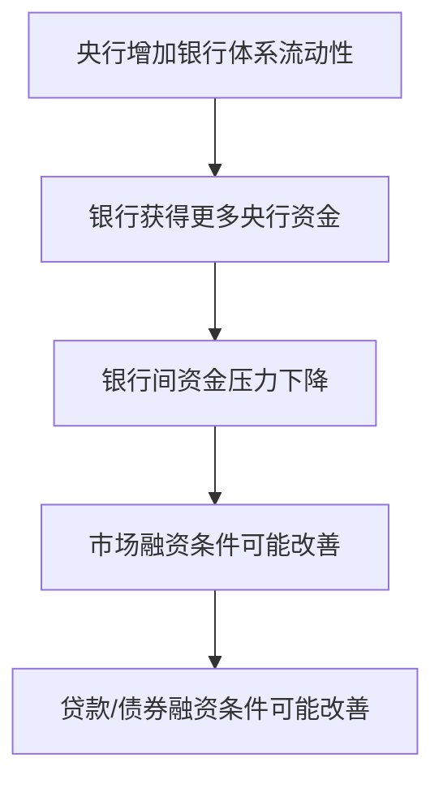
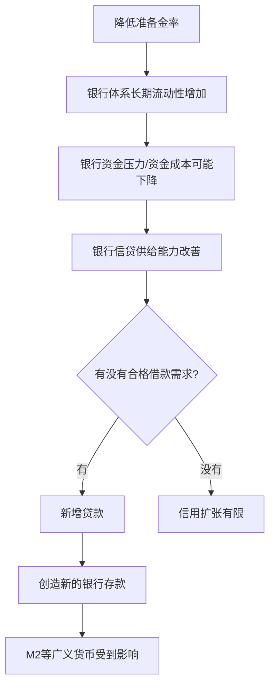
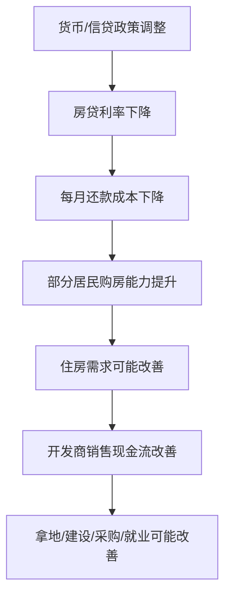
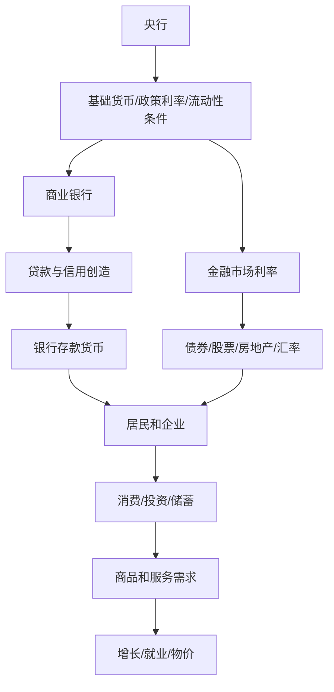

# Day 5｜货币政策如何传导？

> 本课目标：理解央行并不是简单地“把钱发给居民”，而是通过利率、流动性、准备金、预期等渠道改变金融条件，再经过商业银行、金融市场、企业和居民的行为，最终影响投资、消费、就业、物价、资产价格和汇率。

## 1. 先建立总框架：央行不是经济的遥控器

货币政策大致可以理解为：


关键是中间存在很长的“传导链”。因此：

- 央行降息 ≠ 企业一定借钱；
- 降准 ≠ 居民账户自动多钱；
- 流动性宽松 ≠ 房价、股价一定上涨；
- 货币政策有效果，但效果取决于经济主体是否愿意借、愿意花、愿意投资，以及银行是否愿意承担风险。

## 2. 央行主要在控制什么？

入门阶段，可以把央行影响经济的手段归纳成三类。

### 2.1 钱的“价格”：利率

借 100 万一年，如果利率是 6%，资金成本大约是 6 万；如果降到 3%，资金成本大约是 3 万。

因此利率会影响：

- 企业项目是否值得投资；
- 居民是否愿意贷款买房、买车；
- 储户愿意储蓄还是消费；
- 股票、债券、房地产等资产的估值。

### 2.2 银行体系的“流动性”

银行之间需要使用央行货币进行最终结算。央行可以通过公开市场操作、各类流动性工具等影响银行体系资金松紧。



注意“可能”二字：有流动性不代表一定有信用扩张。

### 2.3 银行的约束条件

例如存款准备金率变化会影响银行体系可使用资金和流动性条件。降低准备金率通常可以释放长期流动性，但它不是直接给居民发钱。

## 3. 降息是怎样传导的？

假设一家企业准备建设新工厂，需要借款 1 亿元。

预计项目年化收益率：5%。

### 情况 A：贷款成本 7%

```text
项目收益：5%
贷款成本：7%
结果：项目经济上不划算
```

企业可能放弃投资。

### 情况 B：融资成本下降到 3.5%

```text
项目收益：5%
融资成本：3.5%
理论利差：1.5%
```

企业投资意愿可能上升。

于是传导链可能是：


这就是“利率渠道”。

## 4. 为什么降息以后经济可能还是不起来？

因为融资成本只是企业决策中的一个变量。

例如：

```text
项目预计收益率只有 1%
贷款利率从 5% 降到 3%
```

企业仍然不会借。

或者企业认为未来订单会减少，即使贷款只要 2%，也可能选择不扩产。

居民也是一样：

```text
房贷利率下降
↓
但居民预期收入不稳定
↓
不愿增加长期负债
```

因此货币政策存在一个非常重要的限制：

> 央行能够改善融资条件，却不能强迫企业产生高回报项目，也不能强迫居民承担债务。

这就是为什么经济低迷时期经常出现“宽货币”不一定马上变成“宽信用”。

## 5. 降准到底改变了什么？

简化假设某银行吸收了 1000 亿元存款，需要按照规则在央行保持一定准备金。

假设原来需要 100 亿元，政策调整后只需要 80 亿元。

```text
原状态：1000 亿存款 → 100 亿准备金要求
调整后：1000 亿存款 → 80 亿准备金要求
```

银行体系的长期流动性空间增加了约 20 亿元。

但不能写成：

```text
降准释放20亿
→ 居民银行卡直接 +20亿   ❌
```

更合理的链条是：



这正好把 Day 2 和 Day 3 串起来。

## 6. 公开市场操作是什么？

为了建立直觉，可以把它理解成央行通过金融市场与合格机构进行交易，从而调节银行体系流动性。

简化例子：央行向银行体系投放 100 亿元流动性。

央行资产负债表可能表现为：

| 央行资产 | 央行负债 |
|---|---|
| 对金融机构资产/持有金融资产 +100 亿 | 银行准备金 +100 亿 |

商业银行侧：

| 银行资产变化 |
|---|
| 央行准备金 +100 亿，同时对应其他资产/融资头寸发生变化 |

核心不是死背具体会计分录，而是理解：

> 央行可以通过自己的资产负债表改变银行体系持有的央行货币数量和资金价格。

## 7. 为什么央行一动利率，股票和房价也会动？

因为利率不仅影响贷款，还影响资产估值。

假设有一项资产，每年稳定产生 10 万元现金流。

如果无风险或低风险收益率很高，例如 8%，投资者可能要求很高回报，资产估值会受到压制。

如果安全资产收益率下降到 2%，投资者为了寻找更高收益，可能更愿意购买股票、债券、房地产等风险资产。

于是存在一条资产价格渠道：


但是资产价格不是只由货币政策决定，还受盈利、人口、供求、监管、风险偏好和预期等因素影响。

## 8. 货币政策为什么会影响汇率？

非常简化地说，国际资本会比较不同货币资产的收益和风险。

假设其他条件不变：

```text
A国利率较高
B国利率明显下降
```

部分资金可能更倾向持有收益更高的资产，从而影响跨境资金流动和汇率。

所以传导链可能是：


但现实汇率同时受到贸易、增长预期、风险事件、政策预期等大量因素影响，不能用“降息=货币必然贬值”这种单变量公式判断。

## 9. 最重要的一条：预期渠道

货币政策不仅改变今天的资金价格，还改变大家对未来的判断。

例如央行持续释放宽松信号，市场可能认为：

- 未来融资成本可能继续较低；
- 政策希望稳定增长；
- 流动性环境可能较宽松。

企业和居民可能因此提前调整投资、消费和资产配置。

反过来，如果大家认为未来经济很差，那么即使当前利率已经下降，企业和居民仍可能非常谨慎。

因此现代货币政策很大一部分实际上是在管理：

> **价格 + 流动性 + 信用 + 预期。**

## 10. 用房地产把整条链串起来

假设房地产市场较弱，政策希望降低居民融资成本。

可能发生：



但如果居民认为：

```text
未来收入不稳定
房价还会下跌
人口持续流出
```

那么：

```text
房贷利率下降
↓
居民仍然不买
↓
政策传导变弱
```

所以经济新闻里不能只看“央行做了什么”，还必须看：

> 银行、企业、居民最终怎么反应。

## 11. 用 Day 1～Day 5 串成一张图



到这里，前五天的逻辑已经形成闭环：

1. Day 1：为什么需要货币；
2. Day 2：商业银行如何通过信用创造存款货币；
3. Day 3：基础货币与 M0/M1/M2 为什么不同；
4. Day 4：央行为什么处于货币体系最上层；
5. Day 5：央行如何通过金融体系间接影响实体经济。

## 12. 与数字人民币有什么关系？

这一步非常重要。

数字人民币并不会让货币政策变成：

```text
央行
↓
直接精确控制每个人消费   ❌
```

数字人民币首先是一种央行数字货币和支付基础设施创新。它与货币政策体系存在联系，但不能把“数字化”简单等同于“央行可以随意给每个人账户加钱”。

更值得研究的问题是：如果央行货币能够以数字形式更方便地到达公众，那么它会怎样影响：

- 现金需求；
- 支付体系；
- 商业银行存款；
- 金融脱媒风险；
- 财政资金发放；
- 可编程支付；
- 跨境结算。

这些正是后续课程的核心。

## 13. 今天必须记住的 6 句话

1. **央行主要通过金融条件间接影响经济，而不是直接控制企业和居民行为。**
2. **降息主要改变资金价格，降准主要影响银行体系约束与流动性条件。**
3. **宽货币不一定自动形成宽信用。**
4. **商业银行有流动性，也不意味着一定愿意贷款；企业能借钱，也不意味着一定愿意借。**
5. **货币政策会通过利率、信贷、资产价格、汇率和预期等多个渠道传导。**
6. **判断政策效果，要看传导链最终是否抵达居民和企业的真实消费与投资行为。**

## 14. 思考题

假设现在出现以下情况：

- 央行持续降低资金成本；
- 银行流动性非常充裕；
- 银行也愿意发放贷款；
- 但企业认为未来需求下降，居民认为未来收入不稳定。

请思考：

1. 为什么 M2 和贷款仍可能增长得不够快？
2. 为什么市场可能出现“钱很多，但实体经济感觉钱不多”的现象？
3. 如果资金更多进入债券、股票等金融资产，而不是新建工厂和居民消费，会发生什么？

下一课：**Day 6｜通胀、通缩与货币价值：为什么钱多了不一定马上通胀，为什么通缩有时比温和通胀更麻烦。**