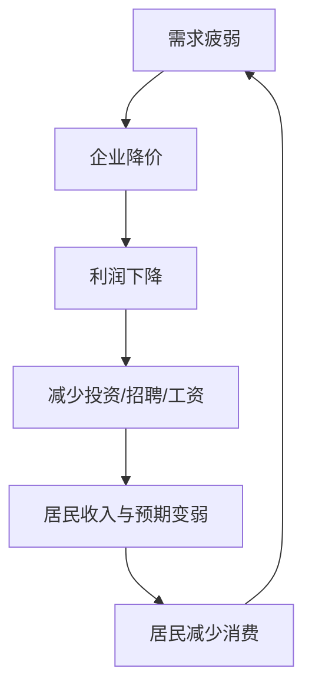
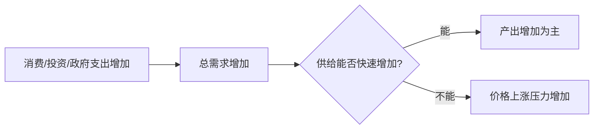
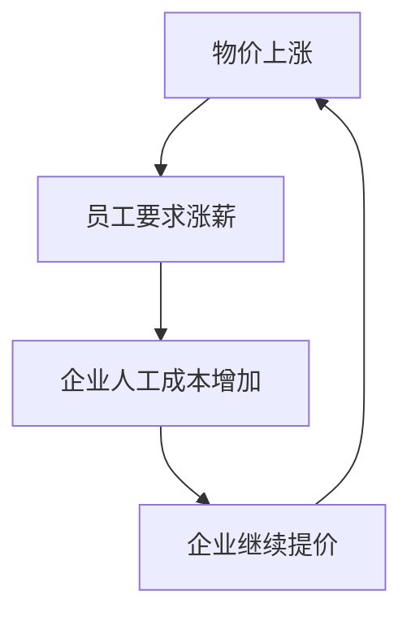
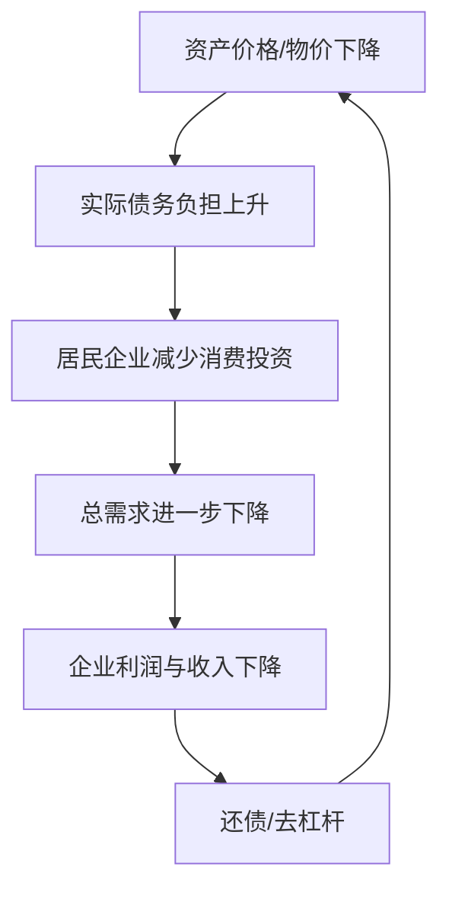
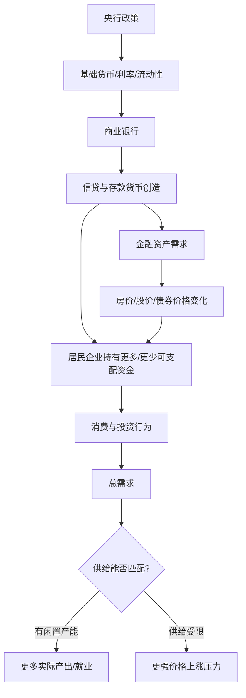

# Day 6｜通胀、通缩与货币价值

> 本课目标：理解通胀、通缩究竟是什么；为什么“货币增加”不等于“物价同比例上涨”；为什么资产价格上涨和消费品通胀不是一回事；以及为什么持续通缩可能形成自我强化的债务与需求循环。

## 1. 通胀不是“某个东西涨价”

如果猪肉因为猪瘟涨价，不能仅凭这一项就判断整个经济发生通胀。宏观意义上的通货膨胀强调的是：**总体价格水平在一段时间内持续、较广泛地上涨，货币购买力相应下降。**

例如原来 100 元可以买 10 份商品篮子，后来只能买 9 份。名义上的 100 元没有减少，但实际购买力下降。


## 2. 通缩是什么？

通缩可以简单理解为总体价格水平持续下降。乍看似乎是好事：东西越来越便宜。但真正危险的是它可能与需求疲弱、收入预期下降和债务压力相互强化。



如果居民进一步形成“以后还会更便宜”的预期，部分可推迟消费还会被继续推迟。

## 3. 为什么“钱多了”不一定马上通胀？

最容易犯的错误是：

```text
货币数量 +10%
→ 所有商品价格立刻 +10%   ❌
```

货币要推动商品和服务价格，需要真正形成有效需求。可以用一个非常简化的框架理解：

> 名义支出大致取决于“有多少可用于支付的货币/信用”以及“这些钱多快被使用”；实际经济能生产多少商品和服务，则决定新增支出更偏向形成实际产出还是价格上涨。

常见表达是数量方程：

```text
M × V = P × Y
```

其中：

- M：货币数量；
- V：货币流通速度；
- P：价格水平；
- Y：实际产出。

它首先是一个恒等关系/分析框架，不应该机械理解为“M增加多少，P就必然增加多少”。V 和 Y 都会变化，货币与信用的构成、金融体系状态和经济主体行为也非常重要。

### 情况 A：货币增加，但大家把钱存着

```text
M ↑
V ↓
需求没有同比例增加
```

物价压力可能有限。

### 情况 B：货币和信用增加，同时企业扩产

```text
需求 ↑
供给/实际产出 Y 也 ↑
```

新增需求的一部分可以通过更多产出来满足，不一定全部变成涨价。

### 情况 C：需求猛增，但供给无法增加

例如经济已经接近满负荷，或能源、粮食、芯片等供给受限：

```text
需求快速 ↑
供给跟不上
→ 更多压力体现为价格上涨
```

## 4. 一个餐馆例子

假设一个小镇只有一家餐馆，每晚最多做 100 份饭。

### 第一种情况：以前只卖 50 份

居民收入改善后需求增加到 70 份。餐馆还有闲置产能，于是可以多做 20 份。

```text
需求：50 → 70
产量：50 → 70
价格：可能变化不大
```

### 第二种情况：餐馆已经每天卖 100 份

现在突然有 150 份需求，但厨房只能生产 100 份。

```text
需求：150
供给：100
```

价格上涨压力就会明显增强。

因此判断通胀不能只问“钱有没有增加”，还要问：

> **需求增加了多少？供给能不能跟上？经济还有多少闲置产能？**

## 5. 需求拉动型通胀

当居民、企业、政府等总体支出增长过快，而供给能力跟不上时，可能形成需求拉动型通胀。



## 6. 成本推动型通胀

即使需求没有特别旺盛，供给端成本突然上升也可能推高价格。

例如：

```text
原油价格上涨
→ 运输成本上涨
→ 化工/制造成本上涨
→ 企业提高售价
```

或者：

```text
粮食歉收
→ 食品供给下降
→ 食品价格上涨
```

因此“发生通胀”不等于“一定是央行印钱导致”。货币条件可能影响通胀的持续性，但供给冲击同样重要。

## 7. 工资—价格循环

如果物价持续上涨，劳动者会要求更高工资：



如果这种循环与通胀预期结合，通胀可能变得更难控制。

所以央行非常重视“通胀预期是否锚定”。

## 8. CPI上涨 ≠ 所有东西都上涨

CPI 是一个消费价格指数，使用一篮子消费品和服务观察居民消费价格总体变化。

即使 CPI 上涨 2%，也不意味着：

```text
猪肉 +2%
房租 +2%
手机 +2%
理发 +2%
```

现实中可能是：

```text
食品 +5%
能源 +8%
部分工业品 -2%
部分服务 +1%
```

加权以后总体形成某个指数变化。

因此“我感觉生活成本涨了很多”和官方总体价格指数之间也可能存在差异，因为每个人的消费篮子不同。

## 9. 房价上涨是不是通胀？

这是必须区分的问题。

房屋、股票等资产价格上涨，与消费品和服务总体价格上涨不是同一个统计和经济概念。

假设大量信用进入房地产：


可能出现：

```text
CPI：相对温和
房价：大幅上涨
股票：大幅上涨
```

因此：

> **货币和信用扩张可能首先反映在资产价格，而不一定马上表现为消费品通胀。**

这也是为什么只盯 CPI 无法完整理解金融周期。

## 10. 为什么资产上涨会反过来影响消费？

假设一个家庭房产和股票上涨很多，会产生“财富增加”的感受，可能更愿意消费。

```text
资产价格上涨
→ 财富感增强
→ 消费意愿可能上升
```

反过来：

```text
房价/股价下跌
→ 家庭资产缩水
→ 更倾向储蓄、还债
→ 消费可能下降
```

这叫财富效应，也是 Day 5 资产价格传导渠道的重要部分。

## 11. 为什么通缩有时比温和通胀更麻烦？

### 原因一：消费和投资可能推迟

如果大家认为：

```text
今天100万
明年90万
```

部分人会选择等待。

```text
等待购买
→ 当前需求下降
→ 企业降价
→ 企业利润下降
```

### 原因二：债务的实际负担变重

这是最关键的一点之一。

假设你欠银行 100 万。债务合同不会因为物价下降自动变成 90 万。

如果工资和企业收入随物价下降：

```text
原收入：20万/年
债务：100万

后来收入：16万/年
债务：仍然100万
```

你的实际偿债压力上升。

于是可能出现“债务—通缩”循环：



### 原因三：利率存在下限约束

如果通胀很低甚至通缩，即使名义利率已经很低，实际利率仍可能偏高。

简化关系：

```text
实际利率 ≈ 名义利率 - 通胀率
```

例如：

```text
名义利率 2%
通胀率 -2%（通缩）
实际利率 ≈ 4%
```

借款人的实际负担反而不轻。

## 12. 为什么央行通常不追求“零通胀”？

很多央行倾向于追求低而稳定的正通胀，而不是长期零通胀或通缩。原因之一是给经济留下缓冲：工资和价格调整更容易，名义利率也有更大的下调空间。

但这不意味着“通胀越高越好”。高通胀会破坏价格信号、侵蚀购买力、增加不确定性，并可能形成失控预期。

目标更接近：

> **保持币值和总体价格环境稳定，而不是追求价格永远不变。**

## 13. 通胀到底是谁受损、谁可能受益？

不能简单说所有人影响完全相同。

### 固定收入者

如果工资不涨而物价上涨：实际购买力下降。

### 现金/低息存款持有者

如果存款利率低于通胀率，实际购买力可能下降。

### 固定利率债务人

在收入随通胀上升的情况下，过去固定的名义债务实际负担可能下降。

### 债权人

如果获得的固定利息无法覆盖通胀，实际回报下降。

所以通胀还会产生财富和收入的再分配效应。

## 14. 名义利率和实际利率

这对以后理解数字人民币是否付息也很重要。

假设银行存款利率：2%。

### 通胀 1%

```text
实际收益 ≈ 2% - 1% = 1%
```

### 通胀 4%

```text
实际收益 ≈ 2% - 4% = -2%
```

你的账户数字虽然增加了，但实际购买力可能下降。

因此研究货币不能只看“账户里有多少钱”，还要看：

> **这些钱能买多少真实商品和服务。**

## 15. 把 Day 1～Day 6 串起来



这张图解释了为什么：

```text
央行放松
≠ 必然通胀
≠ 必然房价上涨
≠ 必然经济增长
```

真正决定结果的是整个传导链。

## 16. 与数字人民币有什么关系？

数字人民币是货币形态和支付基础设施的重要创新，但数字化本身不会改变最基本的宏观约束：

```text
需求 > 供给能力
→ 价格上涨压力

需求不足
→ 价格与经济活动偏弱
```

未来研究数字人民币时，需要把两类问题分开：

### 货币形态问题

- 谁发行？
- 谁负债？
- 钱包如何运行？
- 如何支付和结算？

### 货币政策问题

- 发行量如何管理？
- 是否计息？
- 是否影响银行存款？
- 是否改变政策传导？
- 是否产生金融脱媒？

“人民币变成数字形式”并不意味着宏观经济规律消失。

## 17. 今天必须记住的 7 句话

1. **通胀是总体价格水平持续、广泛上涨，不是某一种商品涨价。**
2. **货币增加不等于物价同比例增加，因为流通速度、实际产出、信用和行为都会变化。**
3. **需求超过供给能力时，价格上涨压力更容易出现。**
4. **供给冲击也能造成通胀，所以不能把所有通胀都简单归因于“印钱”。**
5. **资产价格上涨和消费价格通胀必须区分。**
6. **持续通缩会提高实际债务负担，并可能形成需求下降—收入下降—去杠杆的恶性循环。**
7. **真正重要的是货币的实际购买力，而不只是账户上的名义数字。**

## 18. 思考题

假设一个经济体出现：

- M2 增长较快；
- 银行流动性充裕；
- 居民大量储蓄、提前还贷；
- 企业不愿扩产；
- 房地产价格下降；
- 工厂存在大量闲置产能。

请思考：

1. 为什么即使 M2 很大，CPI 仍可能很低？
2. 为什么继续增加流动性不一定马上解决需求不足？
3. 如果居民都认为未来房价和商品还会更便宜，他们现在的行为会怎样反过来强化通缩？
4. 这种环境下，财政政策和货币政策为什么可能需要协同？

下一课：**Day 7｜第一周总复盘：用一个完整经济体案例，把央行、商业银行、贷款、存款、M0/M1/M2、降准降息、通胀通缩和数字人民币入口全部串起来。**